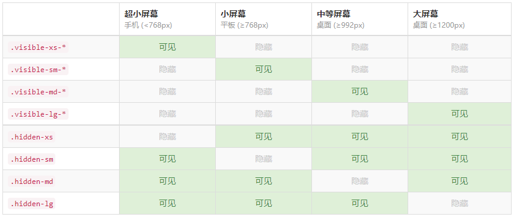

# BootStrap

## lg md sm xs

```html
<div class="col-lg-4 col-md-8 col-xs-6 color1">col-lg-4</div>
<div class="col-lg-4 col-md-4 col-xs-6 color2">col-lg-4</div>
<div class="col-lg-4 col-md-4 col-xs-6 color3">col-lg-4</div>
```

> - lg md sm 这些状态的媒体查询都是设置的最小值，也就是当小于一种状态的最小值时，就切到了下一个状态。xs则是有最大值，但是给xs设置的属于默认布局。也就是如果只设置了col-xs-6，那么所有状态下都是占6份
> - 只要大于这个最小值，就可以算是属于这种状态的屏幕。
> - 如果“下一个状态没有被设置”，默认每一格都占一行。但，如果设置了xs，那么小于xs的最大临界值后依然按照xs分配的布局。如果仅设置了xs，那么所有尺寸下都是按照xs的布局。
> - 例如： 如果仅设置了md,xs，那么当小于了md的临界值后，就直接是xs的状态了。然后再继续小于xs的最小值，不再是每格独占一行，而是按照xs的来分配布局。

## visible-xs/sm等-block

> 只有在自己的size范围内才显示，和col-xs/sm/md/lg不同



## col-xs/sm等-offset-数字（列偏移）

> 是个栅格添加了左侧margin，它的尺寸覆盖性就和visible-xs/sm/md/lg不同了，和col-xs/sm/md/lg是相同的。会把一行内后边的元素也顶起往后移动。就是float元素加了margin的效果。

## 嵌套列

```html
<div class="container">
    <div class="row">
        <div class="col-lg-4">
            <div class="row">
                <div class="col-lg-5 col-md-3 color1">first</div>
                <div class="col-lg-5 col-md-3 color2">second</div>
            </div>
        </div>
        <div class="col-lg-4 color3">col-lg-4 color3</div>
        <div class="col-lg-4 color2">col-lg-4 color2</div>
    </div>
</div>
```

<font color=orange>**嵌套列内部的col-大小-数字，这个大小仍然是指整个窗口**</font>

- 当大于等于lg的临界值时，嵌套列是两个5份的


- 当大于等于md临界值，小于lg时，嵌套列是两个3份的。


- 由于没有设置嵌套列小于md临界值时的状态，所以占**外部列**的全部。


## .col-md-push-3（列排序）

> - 用的是position:relative;给盒子添加left right。会存在遮盖其他元素
>- 里边的xs/sm/md/lg和col-size-数字的覆盖性是一样的。
> - 当栅格单独占一行时，不会有偏移？

push：向右移动

pull：向左移动