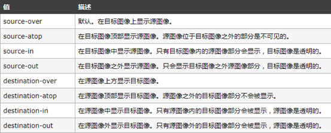
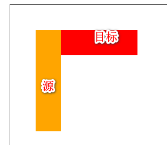
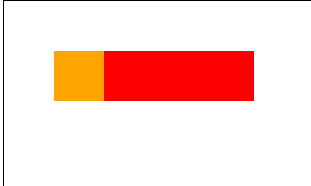
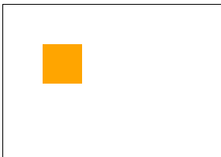
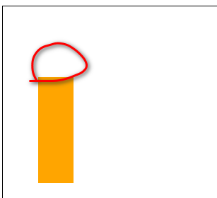
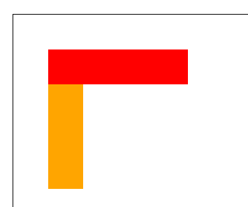
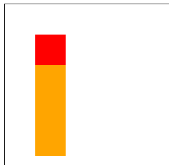
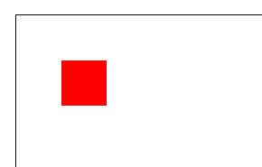
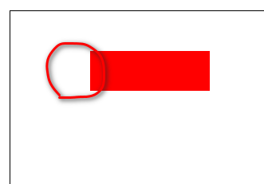

# canvas

canvas 是 HTML5 新增的标签，用来在网页上绘制图像。 英文原意 <span style="color:red">画布</span>


## 应用

canvas 可以应用在以下领域

* 游戏 

  * <https://supermarioemulator.com/mario.php>   
  * <https://heraclosgame.com/>

* 图表 （<https://www.echartsjs.com/examples/zh/index.html>）

* 广告 banner （<https://cloud.tencent.com/>）

* 图形处理 

  * <https://pixlr.com/x/>
  * <https://processon.com/>
  
* 地图

  * <https://www.amap.com/>
  * [https://map.baidu.com](https://map.baidu.com/)


# Attention

- storke()是描绘线段。每次调用都会把<span style="color:orange">本次beginPath()范围内的所有的再描一遍</span>。所以随着storke()调用次数的增多，前边的就被描的越来越重。
- beginPath()用于抛弃之前的storkeStyle<span style="color:orange">（目前来看哈，有待补充）</span>,再重新设置一次style。
- moveTo（）第一次必须要有moveTo，设置画笔的起点，如果后边不再设置moveTo，那么就是直接从上一次的终点连线到这次的lineTo()位置。

## 基本使用

#### 1. 创建 canvas 标签

```html
<canvas id="huabu"></canvas>
```

canvas 标签默认为 300 * 150 的行内块元素，大小的设置可以使用 width 和 height 属性设置， <span style="color:red;font-size:20px;font-weight:bold">但不能使用 css 控制大小</span>。 <span style="color:red;font-size:20px;font-weight:bold">display为inline-block</span>

#### 2. 获取元素对象

```js
var canvas = document.querySelector('#huabu');
```

#### 3. 获取渲染上下文

```js
var ctx = canvas.getContext('2d');
//webgl 3d图形
//webgl2
```

#### 4. 绘制图形

```js
ctx.fillRect(0,0,100,100);
```


## 图形绘制

### 矩形绘制

#### 填充矩形

方法一

```js
ctx.fillStyle = 'rgb(200,208,253)';
ctx.fillRect(100,100,300,200);
```

方法二

```js
ctx.fillStyle = 'rgb(200,208,253)';
ctx.rect(0,0,200,100);
ctx.fill();
```

#### 边框矩形

方法一

```js
ctx.strokeStyle = 'orange';
ctx.lineWidth = 10;
ctx.strokeRect(100,100,300,300);
```

方法二

```js
ctx.strokeStyle = 'orange';
ctx.lineWidth = 10;
ctx.rect(50,50,100,100);
ctx.stroke();
```

- strokeStyle作用范围：一个beginPath内，不管这个stroke是在哪个位置放着。

```javascript
ctx.beginPath();
ctx.strokeStyle= "red";
ctx.moveTo(10,20);
ctx.lineTo(20,40);
ctx.stroke();


ctx.beginPath();//如果没有这个beginPath，前边的线段会再被蓝色覆盖一次
ctx.moveTo(50,50);
ctx.lineTo(20,40);
ctx.strokeStyle= "blue";
ctx.lineTo(60,90);
ctx.stroke();

```

### 擦除

clearRect();

### 线段绘制

开始绘制

```js
ctx.beginPath();
```

移动笔触起始位置

```js
ctx.moveTo(10,10);
```

设置线段宽度

```js
ctx.lineWidth = 10;
```

设置线段颜色

```js
ctx.strokeStyle = 'rgb(90,200,254)';
```

绘制线段

```js
ctx.lineTo(100,200);
ctx.lineTo(200,10);
```

设置线段的始末样式 `lineCap`

* butt:  线段末端以方形结束。(默认值)
* round :  线段末端以圆形结束
* square:  线段末端以方形结束，但是增加了一个宽度和线段相同，高度是线段厚度一半的矩形区域

```js
ctx.lineCap = 'round';
```

设置线段的转角样式` lineJoin`

- round : 圆角
- bevel : 斜角
- miter : 直角

```js
ctx.lineJoin = 'round';
```

描边绘制

```js
ctx.stroke();
```

#### 练习

* 绘制三角形
* 画板

### 圆弧绘制

#### 圆形绘制

调用方法绘制圆

```js
ctx.arc(150,100, 50, 0, 360/180*Math.PI, true);
```

* 150   圆心 x
* 100   圆心 y
* 50     半径
* 0       起始角度
*  360/180*Math.PI    结束角度
* true   是否为逆时针

> <span style="color:red">旋转的零度默认在右侧，顺时针为正角度，逆时针为负角度</span>

绘制框线

```js
ctx.stroke();
```


#### 圆弧绘制

这里用到 arcTo 方法


例子:

```js
ctx.moveTo(100,50);//！！！！！一条边上的一点
		
ctx.arcTo(200, 50, 50, 190, 40);//第一个坐标是切线交点，最后一个数是半径。
//如果moveTo的这个点（第一个点）不是切点的话，在这个点到这条边上的切点会有一条线。

ctx.moveTo(100,50);
ctx.lineTo(200,50);
ctx.lineTo(50,190);

ctx.stroke();
```


## 变形

canvas 变形指的是可以改变绘制的坐标系

* translate  坐标系位移
* scale        坐标系缩放
* rotate      坐标系旋转

这里经常会用到两个功能函数

* <span style="color:orange">save       保存当前的绘图状态</span>
    * 比如我在正常坐标系中画了图，现在要把坐标系移动中间画个图，然后再把坐标系移到原位。那么我就在移动坐标系前save一下，画完图之后，再restore一下。这个save和restore都是针对画布（原点，缩放，旋转、画笔、颜色、宽度等），而不针对已经画上的内容
* <span style="color:orange">restore  恢复之前的绘图状态</span>
* <span style="color:orange">save和restore都可以连续迭代。</span>

练习

* 时钟

## 图片绘制

图片绘制使用的方法是 drawImage 使用示例

```js
var img = new Image;//或者用document.creatElement("img");
img.src = './img/test.jpg';
img.onload = function(){
	ctx.drawImage(img,0,0, 800, 600);
}
```

> <span style="color:orange">一定要在图片加载完毕后，再进行图片绘制</span>

参数说明

* img     要绘制的图片对象
* 0   0     为绘制图片的起始坐标
* 800  600    绘制图片的宽度和高度


练习

* 飞鸟


## 渐变

### 线性渐变

用到的方法是 createLinearGradient ，使用示例

```js
var gradient = ctx.createLinearGradient(100,200, 400,200);
gradient.addColorStop(0, 'red');
gradient.addColorStop(0.5, 'yellow');
gradient.addColorStop(1, 'blue');

ctx.fillStyle = gradient;
ctx.fillRect(100,100, 600,200);
```

createLinearGradient  参数说明：

* 100   200    为渐变的起始点

* 400   200    为渐变的结束点

addColorStop 为渐变对象中的方法， 用来设置渐变进度中的颜色，取值范围为 0 - 1

### 径向渐变

用到的方法是 createRadialGradient，使用示例

```js
var gradient = ctx.createRadialGradient(100,300,20,100,300,50);

gradient.addColorStop(0,'red');
gradient.addColorStop(0.5,'yellow');
gradient.addColorStop(1,'black');

ctx.fillStyle = gradient;
ctx.fillRect(0,0, 800,600);
```

createRadialGradient 参数说明

* 100,300,20  前三个参数标识起始渐变的中心坐标和半径
* 100,300,50  后三个参数标识渐变结束的中心坐标和半径


## 文字

### 绘制文字

#### 填充文字

```js
ctx.fillText('大家好 everybody',300,300);
```

#### 镂空文字

```js
ctx.strokeText('萨瓦迪卡',50,50);
```

文字样式设置

```js
ctx.font = 'bold 40px 微软雅黑';
```


### 文字对齐

#### 水平对齐

```js
ctx.textAlign = 'center';
```

可设置选项

* left  
* start    文字左侧与坐标点垂直对齐
* center  文字中线与坐标点垂直对齐
* end     文字右侧与坐标点垂直对齐
* right


#### 垂直对齐

```js
ctx.textBaseline = 'top';
```

可设置选项

* top               文本基线是 em 方框的顶端
* hanging       文本基线是悬挂基线
* middle         文本基线是 em 方框的正中
* bottom        文本基线是 em 方框的底端
* alphabetic   默认值   文本基线是普通的字母基线

```js
let canvas = document.querySelector("canvas");
let ctx = canvas.getContext("2d");
ctx.translate(200,200);
ctx.moveTo(0,-200);
ctx.lineTo(0,200);
ctx.moveTo(-200,0);
ctx.lineTo(200,0);
ctx.stroke();
ctx.font = "bold 30px 微软雅黑";
ctx.textAlign = "center";
ctx.textAlign = "right";
ctx.textBaseline = "middle";
ctx.textBaseline = "top";
ctx.textBaseline = "hanging";
ctx.fillText("I LOVE YOU",0,0);
// ctx.font = "bold 30px 微软雅黑";//放在后边无效
// ctx.textAlign = "right";
```

## 阴影设置

这里用到 4 个属性

* shadowColor    设置阴影的颜色
* shadowBlur       设置阴影的模糊程度
* shadowOffsetX  设置阴影水平方向的偏移量
* shadowOffsetY  设置阴影垂直方向的偏移量

代码示例

```js
var ctx = canvas.getContext('2d');

ctx.shadowOffsetX = 10;
ctx.shadowOffsetY = 10;
ctx.shadowBlur = 20;
ctx.shadowColor = '#f71888';

ctx.fillRect(50,50, 200,100);
```


## 图形合成

图形合成设置用来控制多个图形的合成规则，有个潜规则标识

* 新绘制的图形标识为   源图形  source
* 已经绘制完毕的图形标识为  目标图形   destination

这里用到一个属性 globalCompositeOperation

使用示例

```js
ctx.globalCompositeOperation = 'source-over';//设置在destination后，source前
```

选项值列表




















### 图形合成练习

刮刮卡


## 像素操作

canvas 可以对画布中的像素进行信息提取和修改。

### 读取像素

这里使用绘制对象中的方法 getImageData

```js
 ctx.getImageData(0,0,10,10)
```

参数说明

* 0  0  前两个参数用来设置像素读取的起始坐标
* 10 10  后两个参数用来设置读取的宽度和高度

getImageData 返回的是每个像素点的信息（颜色和透明度）

> 结果中用 4 个数据标识一个像素点


### 设置像素

这里用到另一个方法 putImageData

```js
ctx.putImageData(imageData, 0, 0);
```

参数说明

* imageData      为像素信息组成的对象。数据结构与像素读取返回的结构相同
* 0  0                   后两个参数为像素填充的起始坐标

